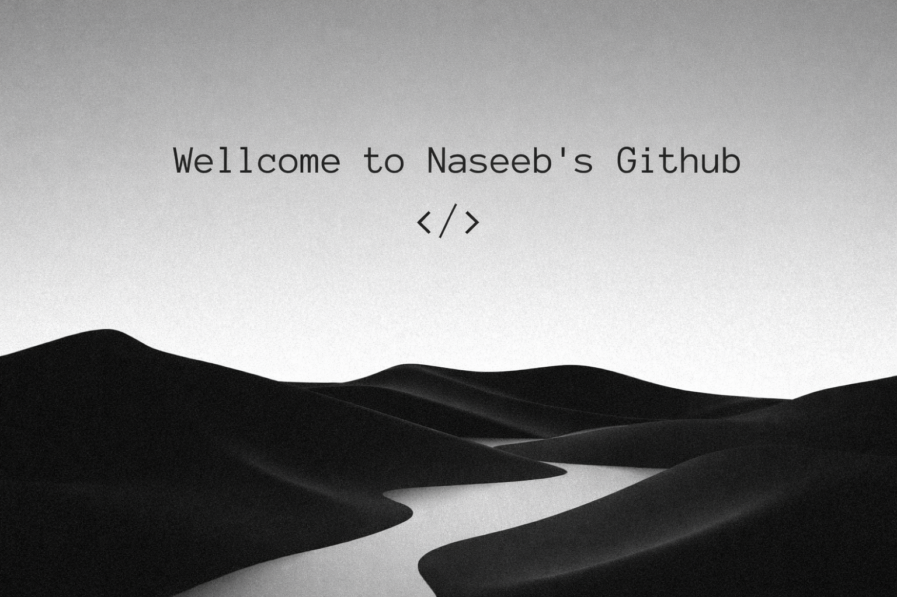

  
  
  
  

 

<h2 align="center"><em>About me</em></h2>

  Hey. I’m <b>Naseeb</b>. A <b>founder and student</b> with a strong interest in
  <b>coding, systems, books, and building things from the ground up</b>.
  I care about understanding how things work, not just making them work.

  I prefer depth over speed, fundamentals over shortcuts, and consistency over hype.
  Right now, I’m focused on improving my programming skills, problem-solving ability,
  and overall technical thinking by building and learning every day.

 

 
 
 

<h2 align="center"><em>Technologies</em></h2>

  
  
  
  
  
  
  
  

 
 

<h2 align="center"><em>Statistics</em></h2>

  

